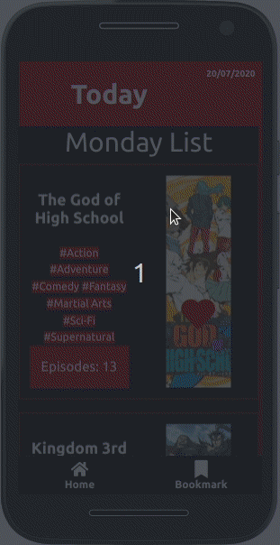

# :calendar: Animecalendar
*Aplicação Web* pra acompanhar alguns laçamentos diário de animes.

## Demo
<p align="center">
  <br/>
  <strong>Caso não seja exibido o gif recarregue a página.</strong>
</p>

## Start
#### Ferramentas
* :pushpin: *node@12.+*
* :pushpin: *npm@6.+*
* :pushpin: *git@2.+*

#### Repositório 
```sh 
git clone git@github.com:dannRocha/animecalendar.git
```

#### :cd: Inicialização
No diretório do repositório
* *Instalação das dependências* 
```sh
npm install
```
* *Inicalização do servidor de desenvolvimento*
```sh
npm start
```

#### :surfer: Navegador
No navegador de internet acesse: ```127.0.0.1:3000``` ou ```localhost:3000```

## :vibration_mode: Considerações
* API: **http://api.jikan.moe/v3/schedule**.
